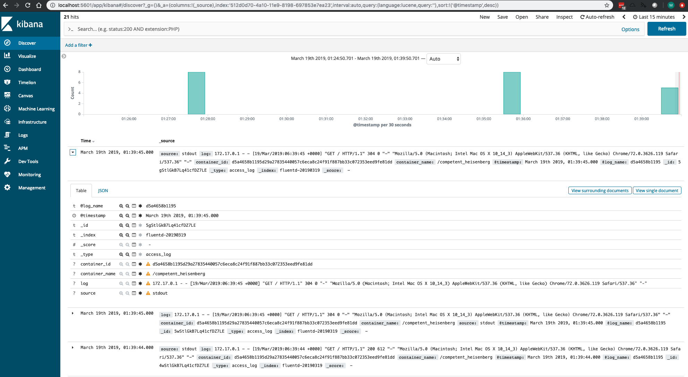
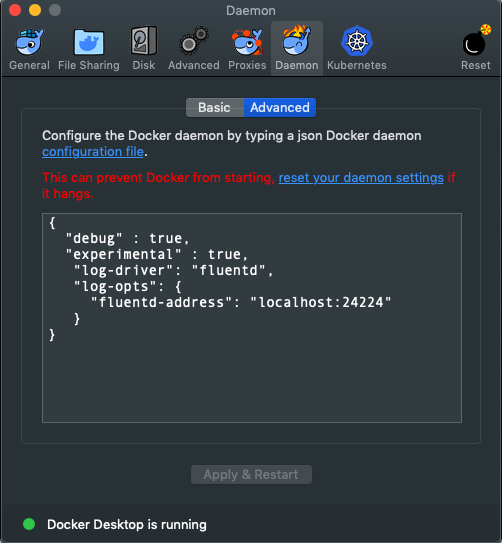
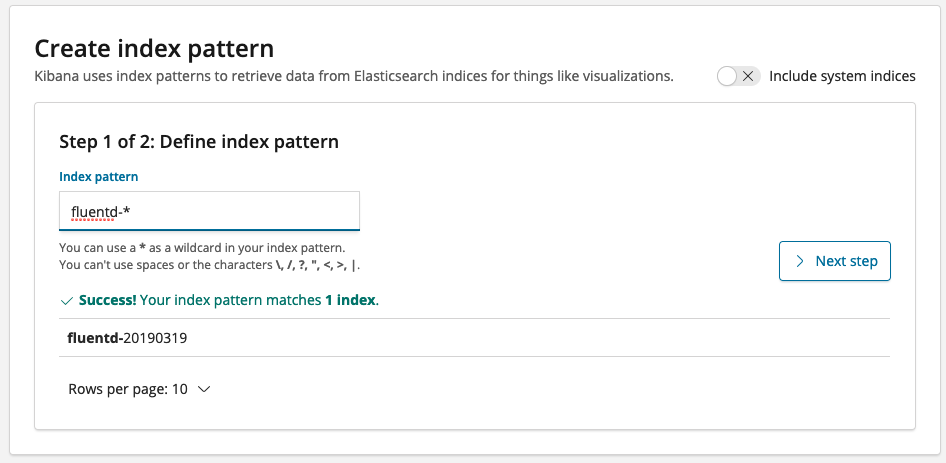

# elasticsearch + fluentd + kibana

## Setup docker to log to fluentd



daemon.json:
```json
{
   "log-driver": "fluentd",
   "log-opts": {
     "fluentd-address": "localhost:24224"
   }
 }
```
## Starting
```bash
docker-compose up -d
 
Starting docker-efk_elasticsearch_1 ... done
Starting docker-efk_fluentd_1       ... done
Starting docker-efk_kibana_1        ... done

```
You can log data into fluentd via port 24224 on localhost.
## Using Kibana
Open your browser to http://localhost:5601

Under Management -> Index Patterns create a new index "fluentd-*"



## Running a test container
Start the nginx container with the fluentd log driver selected:
```bash
docker run --log-driver=fluentd -p80:80 nginx
```
Now you can go to http://localhost and then see the logs populate in kibana!

